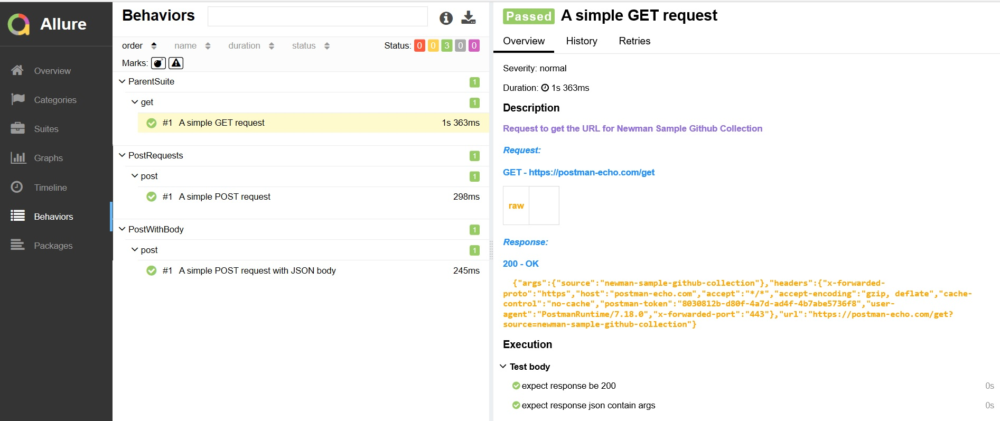

# Archived

> **Warning**
> This repository has been moved to [allure-js](https://github.com/allure-framework/allure-js/tree/master/packages/newman-reporter-allure) repo within [Allure Framework](https://github.com/allure-framework) organization.
> Thanks to everybody for participating :wave:

# cusomization of newman-reporter-allure for personal purposes

A newman reporter for generating nice and clean report using Allure-js framework with collection name as a suite en report results

## Installation

```console
$ npm install -g collsuite
```

## Usage

To generate Allure results, specify `collsuite` in Newman's `-r` or `--reporters` option.

```console
$ newman run <Collection> -e <Environment> -r collsuite
$ newman run <Collection> -e <Environment> -r collsuite --reporter-collsuite-export <allure-results-out-dir>
```

Use the option `--reporter-collsuite-collection-as-parent-suite` to use the collection name as the parent suite title under the _Suites_ view. This helps when you run multiple collections and want to aggregate them in a single report.

Use the option 

```
    reporters: ['collsuite'],
    reporter: {
      collsuite: {
        collectionAsParentSuite: true
      }
    }

```

## Generating and Serving Allure report

Allure results will be generated under folder "allure-results" in the root location.
Use allure-commandline to serve the report locally.

```console
$ allure serve
```

Generate the static report web-application folder using allure-commandline

```console
 $ allure generate --clean
```

Report will be generated under folder "allure-report" in the root location.


